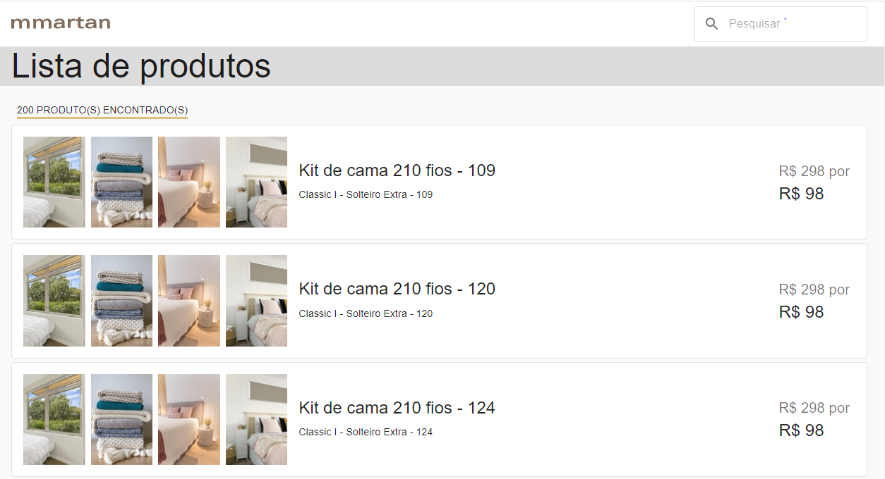

  <h1 align="center">
      mmartan
</h1>
<p align="center">
  
</p>
<h3 align="center">
    Projeto de um e-commerce simples
</h3>


## O projeto

Para a elaboração deste projeto, foi utilizado as tecnologias ReactJs com TypeScript e NodeJS com o framework NestJS. 


## Executando o projeto

### Pré-requisitos

Para executar o projeto, você precisará: 

 - docker-compose
 - npm ou yarn
 - git

**Observação**: No Windows, é necessário a utilização do wsl2. 
 
 Com o repositório clonado acesse a pasta raiz.
 
#### Backend - Executando a API

```bash
# Acesse a pasta backend pelo terminal
# E execute o comando abaixo, para dar permissão ao arquivo do docker-compose
chmod +x .docker/entrypoint.sh

# Em seguida, execute o docker-compose:
docker-compose up 
```

#### Frontend- Executando o site

```bash
# Acesse a pasta frontend pelo terminal
# E execute o comando abaixo, para instalar as dependências
yarn install

# Em seguida, execute o comando start:
yarn start
```


## Tecnologias utilizadas


#### Backend

 - NodeJS
 - NestJS + TypeScript
 - Typeorm
 - Swagger
 - Docker-compose
 - Postgresql

#### Frontend

 - ReactJS + TypeScript
 - Redux + Redux-Thunk
